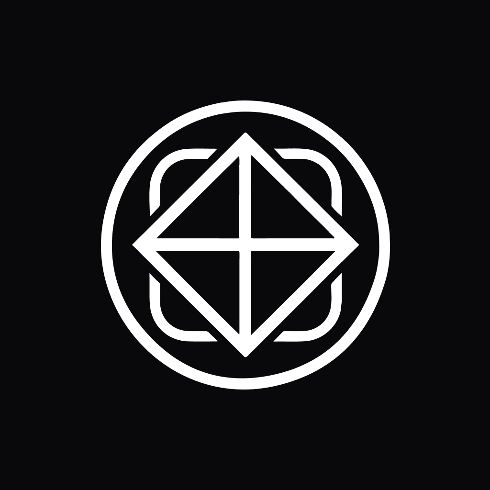

<div>
  
  <h1 align="left">Plann.er</h1>
</div>
<p align="left">  
  Aplicação mobile para planejamento de viagens, desenvolvida com base na trilha React Native do evento NLW Journey realizado pela <a href="https://www.rocketseat.com.br/">RocketSeat</a>. Este projeto teve como objetivo proporcionar ainda mais meu contato com ReactJS e, ao mesmo tempo, aprimorar meus conhecimentos em Typescript e Tailwind CSS. <br><br>
</p>

<p align="center">
  <a href="#-tecnologias">🚀 Tecnologias</a>&nbsp;&nbsp;&nbsp;|&nbsp;&nbsp;&nbsp;
  <a href="#-design">🎨 Design</a>&nbsp;&nbsp;&nbsp;|&nbsp;&nbsp;&nbsp;
  <a href="#-pré-requisitos">☝ Pré-Requisitos</a>&nbsp;&nbsp;&nbsp;|&nbsp;&nbsp;&nbsp;
  <a href="#-como-executar">⚡ Como Executar</a>&nbsp;&nbsp;&nbsp;|&nbsp;&nbsp;&nbsp;
  <a href="#-features-futuras">✨ Features futuras</a>&nbsp;&nbsp;&nbsp;|&nbsp;&nbsp;
  <a href="#-licença">📜 Licença</a>   
  <br><br>

## 🚀 Tecnologias

<div>
  <a href="https://www.typescriptlang.org/" target="_blank"></a>
  <a href="https://reactnative.dev/" target="_blank"></a>
  <a href="https://expo.dev/" target="_blank"></a>
  <a href="https://tailwindcss.com/" target="_blank"></a>
  <a href="https://axios-http.com/" target="_blank"></a>
</div>
<br>

## 🎨 Design

 
<p>Veja com detalhes no <a href="https://www.figma.com/design/aajia3VPE8oyqrmBLlc4Kh/NLW-Journey-%E2%80%A2-Planejador-de-viagem-(Community)?node-id=915-685&t=L1I1u3qsAoPX01FT-0"> Figma</a></p>
<br>

## ☝ Pré-Requisitos

➡️ [Git](https://git-scm.com/) <br>
➡️ [Node.js e NPM](https://nodejs.org/) <br>
<br>

## ⚡ Como executar

Primeiramente, execute o projeto back-end pelo meu repositório abaixo.<br>
Irão prover a API que iremos consumir no aplicativo:

➡️ [Repositório Back-End em Python](https://github.com/MyTruQs/nlw-journey-python) - desenvolvido por [@RaulFernandes](https://github.com/MyTruQs) <br>

Em seguida, clone este repositório

```bash
git clone https://github.com/MyTruQs/nlw-journey-react.git
```

Acesse o diretório da aplicação

```bash
cd nlw-journey-react
```

Faça a instalação das dependências

```bash
npm install
```

Em seu editor de código, crie um arquivo .env e preencha-o conforme instrução do .env.example

Execute a aplicação

```bash
npm run dev
```


<br><br>

#### Desenvolvido por Raul Fernandes 🖖

[](https://https://www.linkedin.com/in/raul-fernandes-1b73361a4/)
[](mailto:raulfernandes.rm@gmail.com)